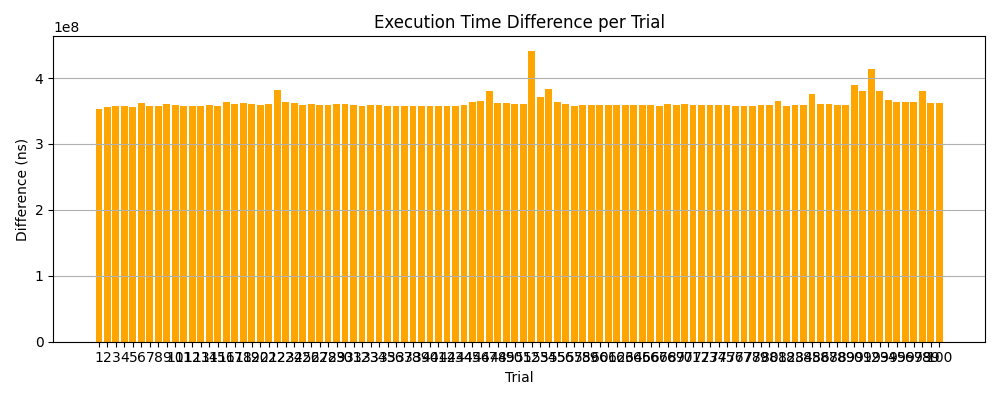

# Branch Prediction Experiment

## Overview
This project investigates the performance cost of **branch misprediction**, a critical bottleneck in modern CPU pipelines during speculative execution. By comparing the execution times of predictable and unpredictable loops, the experiment quantifies how much mispredicted branches can degrade performance.

---

## What is Branch Prediction?
Modern processors try to guess the outcome of conditional branches (like `if` statements) before they're resolved, so they can continue executing instructions without delay. This process is called **branch prediction**.

When the CPU guesses **correctly**, performance is high.
When it guesses **wrong** (a *misprediction*), it must **flush the pipeline** and backtrack — a costly operation that can significantly impact performance.

---

## Experiment Setup
We compare two loops:

- **Predictable Loop**: Uses a condition that the CPU can learn to predict (e.g., a regular alternating pattern like `i % 2 == 0`).
- **Unpredictable Loop**: Uses a random condition (`if dis(gen)`), which is inherently unpredictable for the CPU.

Each loop runs `n` iterations, and the time taken is measured using high-resolution timing. To ensure accurate results:

- Random generators are moved outside the loop to isolate the branch cost.
- A warm-up step runs both loops once before timing begins.
- Loops perform actual work and store results in a `volatile` variable to prevent compiler optimization.
- Multiple trials (user-defined) are averaged for robustness.
- Results are saved to a CSV file.

---

## Build & Run

### Requirements
- C++20 compiler (e.g., `g++` or `clang++`)
- Python 3 with `matplotlib` and `pandas`
- [`kaizen.h`](https://github.com/heinsaar/kaizen) utility library for timer and CLI parsing

### Compile
```bash
make   # or manually:
g++ -std=c++20 -O0 main.cpp -o main
```

### Run
```bash
./main --size 10000000 --trials 10
```

- `--size`: Number of loop iterations
- `--trials`: Number of timing trials to average

This will generate a `branch_prediction_results.csv` file and print the average times to the terminal.

### Plot the Results
```bash
python3 results_analysis.py
```
This creates:
- `loop_execution_times.png`
- `execution_time_differences.png`

---

## Results

### Loop Execution Time per Trial


- Predictable loop times remain stable and low.
- Unpredictable loop times are significantly higher due to branch misprediction penalties.

### Execution Time Difference per Trial


- The difference quantifies the *cost* of misprediction.
- For large `--size` (e.g., 10 million iterations), the cost can be **hundreds of millions of nanoseconds**.

---

## Output Format
When running the executable, expect the following terminal output:

```
| Predictable Loop (avg ns)      | 16539491 |
| Unpredictable Loop (avg ns)    | 386095657 |
| Difference                     | 369556166 |
```

In addition, a CSV will be generated:
```
Trial, Predictable (ns), Unpredictable (ns), Difference (ns)
1, 16382250, 419411958, 403029708
2, 17108417, 421559583, 404451166
3, 16716833, 386272333, 369555500
2, ...
...
Average, 16539491, 386095657, 369556166
```

---

## Conclusion
This experiment offers a clear, visual demonstration of the **performance impact of branch misprediction**. Such low-level inefficiencies are often overlooked in high-level software design, but they can have substantial effects in performance-critical systems like game engines, databases, or scientific computing.

---

Happy hacking! 🚀
